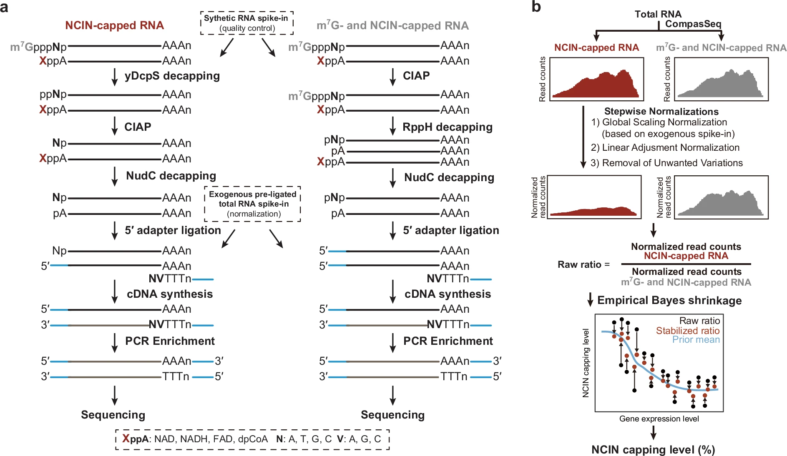

<!-- README.md is generated from README.Rmd. Please edit that file -->

```{r, include = FALSE}
knitr::opts_chunk$set(
  collapse = TRUE,
  comment = "#>",
  fig.path = "man/figures/README-",
  out.width = "100%"
)
```

# compassanalyzer <a href="https://github.com/thereallda/compassanalyzer"></a>

<!-- badges: start -->

<!-- badges: end -->

`compassanalyzer` quantifies the non-canonical initiating nucleotide (NCIN) capping ratio at transcript-resolution using CompasSeq data. In brief, `compassanalyzer` employs stepwise normalization to account for unwanted technical variation across samples and employs an empirical Bayes shrinkage approach to estimate transcript-specific NCIN capping ratios across the epitranscriptome.

For a more detailed description of `compassanalyzer`, check out our publication **"CompasSeq: epitranscriptome-wide percentage assessment of metabolite-capped RNA at the transcript resolution"** in Nature Communications (<DOI:10.1038/s41467-025-61697-y>). Please cite this article if you use `compassanalyzer` in your studies, and we'd be very grateful!

## Installation

You can install the development version of compassanalyzer like so:

``` r
# install.packages("devtools")
devtools::install_github("thereallda/compassanalyzer")
```

## Quick Start

### Load package

`compassanalyzer` relies on `enONE` to perform RUV normalization to estimate unwanted variation. Please make sure you have installed the `enONE` package.

```{r,warning=FALSE,message=FALSE}
library(tidyverse)

# if you do not have `enONE` package installed, run the following code first: 
# devtools::install_github("thereallda/enONE")
if (!requireNamespace("enONE", quietly = TRUE)) { devtools::install_github("thereallda/enONE") }
library(enONE)
library(compassanalyzer)
```

### Load data

For this tutorial, we will demonstrate the `compassanalyzer` workflow by using a CompasSeq data from mouse livers.

Notably, we included two types of spike-in RNAs:

-   Total RNAs from Drosophila melanogaster, an invertebrate model organism with well-annotated genome sequence, for estimating the unwanted variation;
-   Synthetic RNAs, consisting of 0%, 1%, 5%, and 20% NAD-RNA, for assessing the quantification accuracy of `compassanalyzer`

{width="700"}

```{r}
counts_df <- read.csv("data/Counts_demo.csv", row.names = 1)
meta <- read.csv("data/meta_demo.csv")
head(meta)
# rownames of metadata should be consistent with the colnames of counts_mat
rownames(meta) <- meta$id

# metadata for synthetic RNA
syn_id <- paste("syn",1:4, sep = "_")
syn_meta <- data.frame(
  id = syn_id,
  per = c(0.05,0.01,0.20,0)
)
```

### Filtering

We consider genes with at least 20 counts in more than 2 samples.

```{r}
counts_keep <- enONE::FilterLowExprGene(counts_df,
                                        group = meta$condition,
                                        min.count = 20)
```

### Create object

When constructing `Compass` object, we can provide following arguments:

-   Prefix of spike-in genes (`spike.in.prefix = "^FB"`);

-   The id of synthetic spike-in (`synthetic.id = c("syn_1", "syn_2", "syn_3", "syn_4")`), which should be consistent with row names in `counts_mat`;

-   The id of input (`input.id = "Input"`) and enrichment (`enrich.id = "Enrich"`), same as the enrich column.

```{r}
Compass <- createCompass(counts_keep,
                         col.data = meta,
                         spike.in.prefix = "^FB",
                         input.id = "Input",
                         enrich.id = "Enrich",
                         synthetic.id = syn_meta$id)

```

### Using enONE to perform RUV normalization

```{r}
Enone <- createEnone(data = counts_keep,
                     col.data = meta,
                     spike.in.prefix = "FB",
                     input.id = "Input",
                     enrich.id = "Enrich"
)
Enone <- enONE(Enone,
               scaling.method = c("TMM"),
               ruv.norm = TRUE, ruv.k = 3,
               eval.pam.k = 2:4, eval.pc.n = 3,
               return.norm = TRUE
)
# use RUVs_k3
norm.factors <- enONE::getFactor(Enone, slot="sample", method="TMM_RUVs_k3")
names(norm.factors)
```

### Calculate Ratio

RUV factors from `enONE` can be passed into `compassanalyzer` for ratio calculation.

To obtain further accurate NCIN capping ratio, `ratio.shrinkage = TRUE` can be applied.

```{r}
Compass <- CompassAnalyze(Compass,
                           adjust = TRUE,
                           prop.top.enrich = 0.8,
                           decreasing = TRUE,
                           pseudo.count = 1,
                           enone.ruv.factor = norm.factors,
                           ratio.shrinkage = TRUE)
# prior ratio
ratio_pri_df <- getRatio(Compass, slot = "sample", ratio.shrinkage = F, filter = T)
head(ratio_pri_df)

# To get shrunk ratio
qratio_ls <- getRatio(Compass, slot = "sample", ratio.shrinkage = T, filter = T)
names(qratio_ls)
head(qratio_ls$Young)
```

### Synthetic RNA Calibration curve

Finally, we can use synthetic RNAs with known capping ratio to check the accuracy of our quantification.

```{r}
syn_ratio <- synRatio(Compass, ratio.shrinkage=TRUE, syn.meta = syn_meta)
head(syn_ratio)
synScatter(ratio.df = syn_ratio, syn.meta = syn_meta)
```
