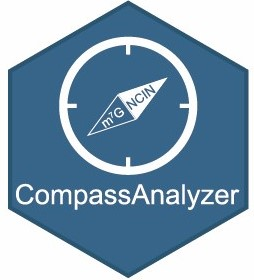
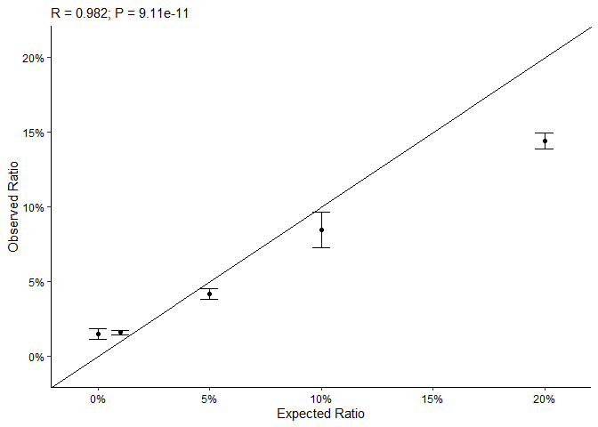

<!-- README.md is generated from README.Rmd. Please edit that file -->

# compassanalyzer <a href="https://github.com/thereallda/compassanalyzer"></a>

<!-- badges: start -->
<!-- badges: end -->

## Installation

You can install the development version of compassanalyzer like so:

``` r
# install.packages("devtools")
devtools::install_github("thereallda/compassanalyzer")
```

## Quick Start

### Load package

``` r
library(tidyverse)

# if you do not have `enONE` package installed, run the following code first: 
# devtools::install_github("thereallda/enONE")
if (!requireNamespace("enONE", quietly = TRUE)) { devtools::install_github("thereallda/enONE") }
library(enONE)
library(compassanalyzer)
```

### Load data

``` r
counts_df <- read.csv("data/Counts1.csv", row.names = 1)
meta <- read.csv("data/metadata1.csv")
head(meta)
#>        id condition replicate enrich
#> 1 Y1_CRNT  WT.Input         1  Input
#> 2 Y2_CRNT  WT.Input         2  Input
#> 3 Y3_CRNT  WT.Input         3  Input
#> 4 Y1_YCNT WT.Enrich         1 Enrich
#> 5 Y2_YCNT WT.Enrich         2 Enrich
#> 6 Y3_YCNT WT.Enrich         3 Enrich
# rownames of metadata should be consistent with the colnames of counts_mat
rownames(meta) <- meta$id

# metadata for synthetic RNA
syn_id <- paste("syn",3:7, sep = "_")
syn_meta <- data.frame(
  id = syn_id,
  per = c(0.05,0.01,0.20,0,0.10)
)
```

### Filtering

``` r
counts_keep <- enONE::FilterLowExprGene(counts_df,
                                        group = meta$condition,
                                        min.count = 20)
```

### Create object

``` r
Compass <- createCompass(counts_keep,
                         col.data = meta,
                         spike.in.prefix = "^FB",
                         input.id = "Input",
                         enrich.id = "Enrich",
                         synthetic.id = syn_meta$id)
```

### Calculate Ratio

``` r
Compass <- CompassAnalyze(Compass)
#> Global scaling...
#> Linear regression-based adjustment...
#> Computation of NCIN Ratio...
qratio_df <- getRatio(Compass, slot = "sample", filter = T)
head(qratio_df);dim(qratio_df)
#>                       Y1_YCNT    Y2_YCNT    Y3_YCNT
#> ENSMUSG00000100954 0.04605680 0.02392197 0.01336620
#> ENSMUSG00000051285 0.28605972 0.22196503 0.46417798
#> ENSMUSG00000048538 0.06555230 0.08062193 0.10834769
#> ENSMUSG00000057363 0.04013835 0.05196659 0.03195173
#> ENSMUSG00000033021 0.03507386 0.04809227 0.04212718
#> ENSMUSG00000061024 0.04004754 0.06341580 0.06380841
#> [1] 8807    3
```

### Synthetic RNA Calibration curve

``` r
synScatter(ratio.df = qratio_df, syn.meta = syn_meta)
```


