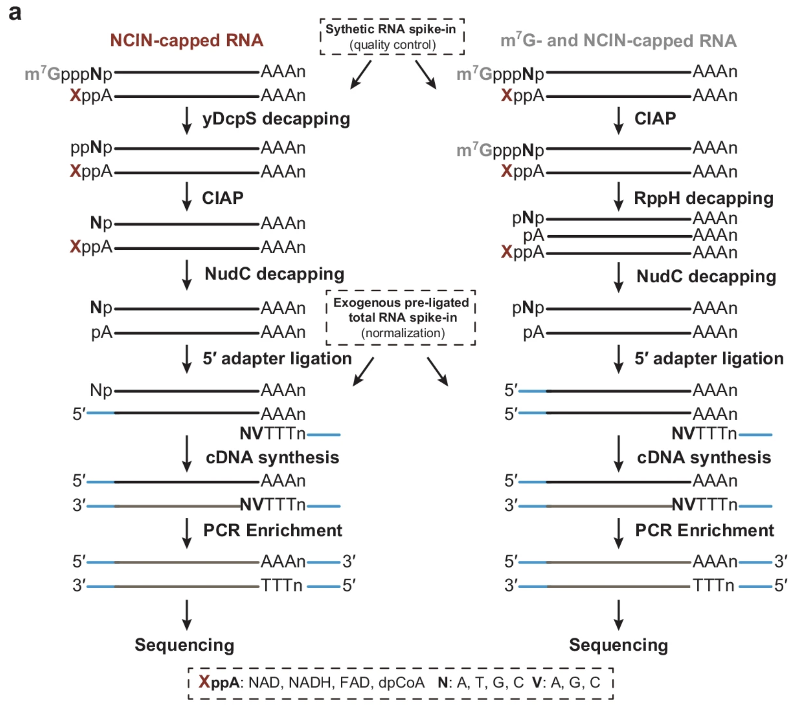
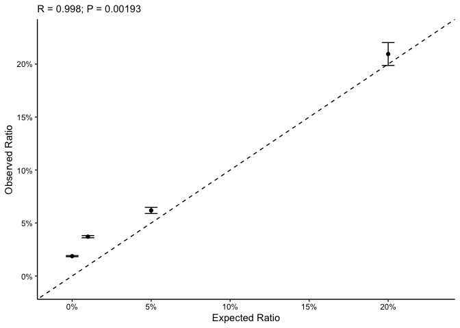

<!-- README.md is generated from README.Rmd. Please edit that file -->

# compassanalyzer 

<!-- badges: start -->
<!-- badges: end -->

`compassanalyzer` quantifies the non-canonical initiating nucleotide (NCIN) capping ratio at transcript-resolution using CompasSeq data. In brief, `compassanalyzer` employs stepwise normalization to account for unwanted technical variation across samples and employs an empirical Bayes shrinkage approach to estimate transcript-specific NCIN capping ratios across the epitranscriptome.

For a more detailed description of `compassanalyzer`, check out our publication **“CompasSeq: epitranscriptome-wide percentage assessment of metabolite-capped RNA at the transcript resolution”** in Nature Communications (<DOI:10.1038/s41467-025-61697-y>). Please cite this article if you use `compassanalyzer` in your studies, and we’d be very grateful!

## Installation

You can install the development version of compassanalyzer like so:

    # install.packages("devtools")
    devtools::install_github("thereallda/compassanalyzer")

## Quick Start

### Load package

`compassanalyzer` relies on `enONE` to perform RUV normalization to estimate unwanted variation. Please make sure you have installed the `enONE` package.

    library(tidyverse)

    # if you do not have `enONE` package installed, run the following code first: 
    # devtools::install_github("thereallda/enONE")
    if (!requireNamespace("enONE", quietly = TRUE)) { devtools::install_github("thereallda/enONE") }
    library(enONE)
    library(compassanalyzer)

### Load data

For this tutorial, we will demonstrate the `compassanalyzer` workflow by using a CompasSeq data from mouse livers.

Notably, we included three types of spike-in RNAs:

-   Total RNAs from Drosophila melanogaster, an invertebrate model organism with well-annotated genome sequence, for estimating the unwanted variation;
-   Synthetic RNAs, consisting of 0%, 1%, 5%, and 20% NAD-capping, for assessing the quantification accuracy of `compassanalyzer`

    counts_df <- read.csv("data/Counts_demo.csv", row.names = 1)
    meta <- read.csv("data/meta_demo.csv")
    head(meta)
    #>        id   condition replicate enrich biology
    #> 1 Y1.CRNT Young.Input         1  Input   Young
    #> 2 Y2.CRNT Young.Input         2  Input   Young
    #> 3 Y3.CRNT Young.Input         3  Input   Young
    #> 4 O1.CRNT   Old.Input         1  Input     Old
    #> 5 O2.CRNT   Old.Input         2  Input     Old
    #> 6 O3.CRNT   Old.Input         3  Input     Old
    # rownames of metadata should be consistent with the colnames of counts_mat
    rownames(meta) <- meta$id

    # metadata for synthetic RNA
    syn_id <- paste("syn",1:4, sep = "_")
    syn_meta <- data.frame(
      id = syn_id,
      per = c(0.05,0.01,0.20,0)
    )

### Filtering

We consider genes with at least 20 counts in more than 2 samples.

    counts_keep <- enONE::FilterLowExprGene(counts_df,
                                            group = meta$condition,
                                            min.count = 20)

### Create object

When constructing `Compass` object, we can provide following arguments:

-   Prefix of spike-in genes (`spike.in.prefix = "^FB"`);

-   The id of synthetic spike-in (`synthetic.id = c("syn_1", "syn_2", "syn_3", "syn_4")`), which should be consistent with row names in `counts_mat`;

-   The id of input (`input.id = "Input"`) and enrichment (`enrich.id = "Enrich"`), same as the enrich column.

<!-- -->

    Compass <- createCompass(counts_keep,
                             col.data = meta,
                             spike.in.prefix = "^FB",
                             input.id = "Input",
                             enrich.id = "Enrich",
                             synthetic.id = syn_meta$id)

### Using enONE to perform RUV normalization

    Enone <- createEnone(data = counts_keep,
                         col.data = meta,
                         spike.in.prefix = "FB",
                         input.id = "Input",
                         enrich.id = "Enrich"
    )
    Enone <- enONE(Enone,
                   scaling.method = c("TMM"),
                   ruv.norm = TRUE, ruv.k = 3,
                   eval.pam.k = 2:4, eval.pc.n = 3,
                   return.norm = TRUE
    )
    #> Gene set selection for normalization and assessment...
    #> - The number of negative control genes for normalization: 1000 
    #> - Estimate dispersion & Fit GLM... 
    #> - Testing differential genes... 
    #> - The number of positive evaluation genes: 500 
    #> - Estimate dispersion & Fit GLM... 
    #> - Testing differential genes... 
    #> - The number of negative evaluation genes: 500 
    #> - Estimate dispersion & Fit GLM... 
    #> - Testing differential genes... 
    #> Apply normalization...
    #> - Scaling... 
    #> - Regression-based normalization... 
    #> Perform assessment...
    # use RUVs_k3
    norm.factors <- enONE::getFactor(Enone, slot="sample", method="TMM_RUVs_k3")
    names(norm.factors)
    #> [1] "normFactor"   "adjustFactor" "alpha"

### Calculate Ratio

RUV factors from `enONE` can be passed into `compassanalyzer` for ratio calculation.

To obtain further accurate NCIN capping ratio, `ratio.shrinkage = TRUE` can be applied.

    Compass <- CompassAnalyze(Compass,
                               adjust = TRUE,
                               prop.top.enrich = 0.8,
                               decreasing = TRUE,
                               pseudo.count = 1,
                               enone.ruv.factor = norm.factors,
                               ratio.shrinkage = TRUE)
    #> Global scaling...
    #> Adjustment...
    #> Computation of NCIN Ratio...
    # prior ratio
    ratio_pri_df <- getRatio(Compass, slot = "sample", ratio.shrinkage = F, filter = T)
    head(ratio_pri_df)
    #>                      Y1.YCNT    Y2.YCNT   Y3.YCNT    O1.YCNT    O2.YCNT
    #> ENSMUSG00000102095 0.8760169 0.85110650 0.6406086 0.45137139 0.82456465
    #> ENSMUSG00000100954 0.0675589 0.07308805 0.1478581 0.04505377 0.04822527
    #> ENSMUSG00000051285 0.9063729 0.61631150 0.7027077 0.88291054 0.92033825
    #> ENSMUSG00000048538 0.3355405 0.19180049 0.2284953 0.29898472 0.26557362
    #> ENSMUSG00000057363 0.3877506 0.38546594 0.3984642 0.14325951 0.24661647
    #> ENSMUSG00000033021 0.1078250 0.09019188 0.1323975 0.10851616 0.11100149
    #>                       O3.YCNT
    #> ENSMUSG00000102095 0.46799184
    #> ENSMUSG00000100954 0.04397671
    #> ENSMUSG00000051285 0.40701103
    #> ENSMUSG00000048538 0.16897713
    #> ENSMUSG00000057363 0.31397557
    #> ENSMUSG00000033021 0.09994700

    # To get shrunk ratio
    qratio_ls <- getRatio(Compass, slot = "sample", ratio.shrinkage = T, filter = T)
    names(qratio_ls)
    #> [1] "Old"   "Young"
    head(qratio_ls$Young)
    #>               GeneID    Y1.YCNT    Y2.YCNT    Y3.YCNT ratio.shrunk
    #> 2 ENSMUSG00000000049 0.04600355 0.03835692 0.04770413   0.04402174
    #> 3 ENSMUSG00000000056 0.62350553 0.45791580 0.54813227   0.54338147
    #> 4 ENSMUSG00000000078 0.37052160 0.23323078 0.37417502   0.32611932
    #> 5 ENSMUSG00000000085 0.79885762 0.62883404 0.80058388   0.74415877
    #> 6 ENSMUSG00000000088 0.05824312 0.05751213 0.05603951   0.05726493
    #> 7 ENSMUSG00000000120 0.36088816 0.31905863 0.27540424   0.31849086
    #>   ratio.shrunk.sd
    #> 2    0.0028745359
    #> 3    0.0478876714
    #> 4    0.0463753959
    #> 5    0.0570640663
    #> 6    0.0006480261
    #> 7    0.0246775840

### Synthetic RNA Calibration curve

Finally, we can use synthetic RNAs with known capping ratio to check the accuracy of our quantification.

    syn_ratio <- synRatio(Compass, ratio.shrinkage=TRUE, syn.meta = syn_meta)
    head(syn_ratio)
    #>   GeneID      ratio    ratio.sd     ratio.se  per
    #> 1  syn_1 0.06187351 0.007097955 0.0028977282 0.05
    #> 2  syn_2 0.03711141 0.002504890 0.0010226169 0.01
    #> 3  syn_3 0.20948635 0.026411163 0.0107823121 0.20
    #> 4  syn_4 0.01871811 0.001357093 0.0005540309 0.00
    synScatter(ratio.df = syn_ratio, syn.meta = syn_meta)

